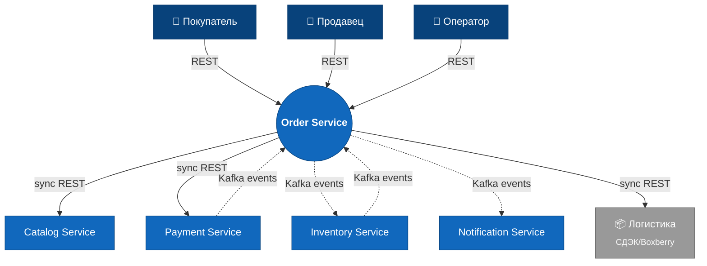

## 1. Bounded Context (ограниченный контекст)

**Контекст: «Оформление заказа» (Order)**

### Отвечает за

- Жизненный цикл `Order` от черновика (`DRAFT`) до закрытия (`COMPLETED`/`REFUNDED`).
- Резервирование остатка у продавцов на момент оформления.
- Запуск платежа и реакцию на его исход.
- Координацию Saga: платёж ↔ инвентарь ↔ доставка ↔ уведомления.
- Публикацию доменных событий (`OrderConfirmed`, `OrderPaid`, `OrderShipped`, …) в Kafka через Outbox.
- Обработку отмен и возвратов на стороне заказа (само возмещение — в Payment).

### Не отвечает за

- Каталог товаров и поиск (контекст «Catalog»).
- Списание и пополнение остатка (контекст «Inventory»).
- Платёжные шлюзы и комиссии (контекст «Payment»).
- Доставку через внешних логистов (контекст «Customer BFF»/внешние ребра).
- Расчёты с продавцами (внутри Payment, см. сводный кейс).
- Аутентификацию (делегируется IdP — Keycloak).

### Соседние контексты

- **Customer BFF** — основной inbound: команды покупателя (создать, оплатить, отменить, открыть спор) приходят через REST. _Тип связи_: Customer-Supplier (Order — supplier).
- **Seller / Admin BFF** — inbound для продавца (отметить отправку) и оператора (закрыть спор). _Тип связи_: Customer-Supplier.
- **Catalog Service** — outbound REST sync: проверка существования и цены товара при оформлении черновика. _Тип связи_: Conformist (Order соответствует контракту Catalog).
- **Inventory Service** — двунаправлено через Kafka: Order публикует `OrderConfirmed` → Inventory резервирует и отвечает `ItemReserved`/`ReservationFailed`. _Тип связи_: Customer-Supplier (Order — customer reservation API).
- **Payment Service** — outbound REST sync (запуск платежа) + Kafka inbound (`PaymentSucceeded`/`PaymentFailed`). _Тип связи_: Customer-Supplier.
- **Notification Service** — outbound через Kafka (подписан на `OrderConfirmed`/`OrderShipped`/`OrderRefunded`). _Тип связи_: Open Host Service со стороны Order.

### Стейкхолдеры и владелец

- **Владелец**: команда «Заказы» (Order team).
- **Зависят от нас**: команды Customer BFF, Notification, Settlement (через события).
- **От кого зависим**: Catalog (валидация товаров), Payment (исполнение платежа), Inventory (резерв и снятие).

### Диаграмма C1 — System Context

