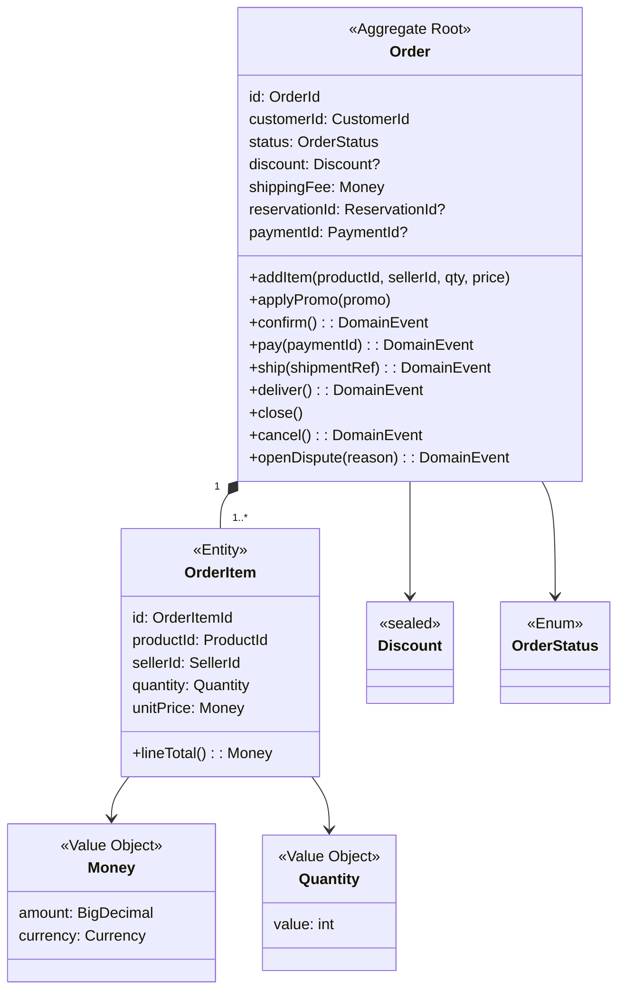
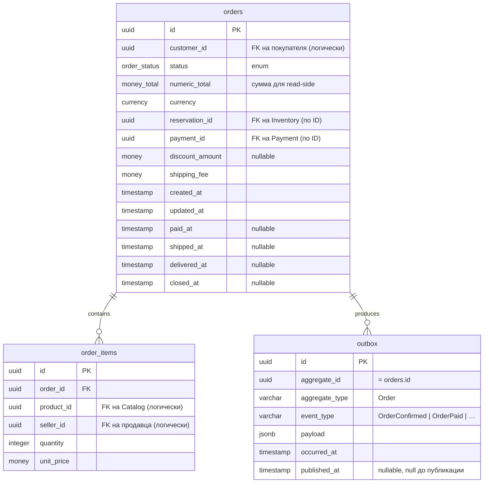

## 3. Domain Model

### 3.1 Агрегаты

**Агрегат `Order`** — корень. Защищает инварианты: согласованность суммы, валидность переходов состояний, отсутствие дублирования позиций по `(productId, sellerId)`.

| Атрибут | Тип | Описание |
|---|---|---|
| id | `OrderId` (UUID) | первичный ключ |
| customerId | `CustomerId` (UUID) | FK на покупателя (по ID) |
| status | `OrderStatus` (enum) | текущая фаза жизненного цикла |
| items | `List<OrderItem>` | позиции заказа, ≥ 1 для перехода в `PENDING_PAYMENT` |
| discount | `Discount?` | применённая скидка (от промокода или акции) |
| shippingFee | `Money` | стоимость доставки |
| total | `Money` (вычисляется) | сумма позиций − скидка + доставка |
| reservationId | `ReservationId?` | id внешнего резерва в Inventory; null до `PENDING_PAYMENT` |
| paymentId | `PaymentId?` | id последней успешной попытки платежа |
| paidAt / shippedAt / deliveredAt / closedAt | `Instant?` | временные метки переходов |
| createdAt / updatedAt | `Instant` | служебные |
| events | `List<DomainEvent>` | накопленные события (clear после публикации) |

### 3.2 Сущности

**`OrderItem`** — внутренняя сущность. Уникальна в рамках агрегата по `(productId, sellerId)`. Не существует вне `Order`. Содержит: `productId`, `sellerId`, `quantity` (`Quantity` VO), `unitPrice` (`Money` VO), `lineTotal` (вычисляемое).

### 3.3 Value Objects

- **`OrderId`**, **`OrderItemId`**, **`CustomerId`**, **`SellerId`**, **`ProductId`** — типизированные обёртки над UUID. `equals` по значению.
- **`Money`** — `BigDecimal amount` + `Currency currency` (всегда RUB в этой версии). Immutable. Операции `add`/`subtract`/`multiply` возвращают новый `Money`. Не допускает отрицательных сумм.
- **`Quantity`** — целое число от 1 до 999. Защищает от отрицательных и нулевых количеств.
- **`Discount`** — sealed: `PercentageDiscount(BigDecimal pct)` либо `FixedDiscount(Money amount)`. Применяется к `OrderTotal`.
- **`OrderStatus`** — enum: `DRAFT`, `PENDING_PAYMENT`, `PAID`, `SHIPPED`, `DELIVERED`, `COMPLETED`, `EXPIRED`, `CANCELLED`, `REFUNDED`, `DISPUTE`.
- **`Address`** — адрес доставки: страна, город, улица, индекс, ПВЗ-код (если применимо).

### Диаграмма C3 — Domain Model

### 3.4 Доменные события

Список — в [08-order-service-events](08-order-service-events.md). Публикуются из агрегата через `registerEvent(...)` и доставляются репозиторием в `Outbox` в той же транзакции с `save`.

### 3.5 Схема базы данных

Индексы:
- `idx_orders_customer_status (customer_id, status)` — UC-5 (заказы покупателя).
- `idx_orders_seller_status (seller_id, status)` через JOIN с `order_items` (или materialized view) — UC-6 (заказы продавца).
- `idx_outbox_unpublished (occurred_at) WHERE published_at IS NULL` — Outbox-relay.
