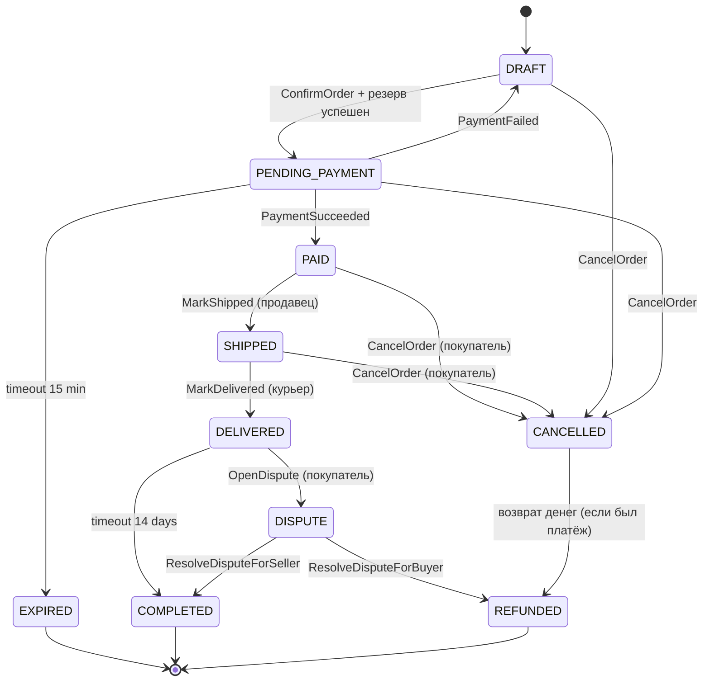

## 4. Жизненный цикл и состояния

### Состояния `OrderStatus`

| Код | Описание |
|---|---|
| `DRAFT` | заказ создан, можно добавлять/убирать позиции; ничего не зарезервировано |
| `PENDING_PAYMENT` | резерв в Inventory успешен, ждём оплату; есть таймаут 15 мин |
| `PAID` | платёж подтверждён банком; продавцу прилетело уведомление |
| `SHIPPED` | продавец передал курьеру/в ПВЗ |
| `DELIVERED` | вручено покупателю; идёт окно для спора (14 дней) |
| `COMPLETED` | окно споров закрыто, выручка идёт в Settlement |
| `EXPIRED` | таймаут оплаты — резерв снят, заказ закрыт без денег |
| `CANCELLED` | отмена покупателем до отправки (с возвратом денег если оплачено) |
| `DISPUTE` | покупатель открыл спор после доставки, ждём решения оператора |
| `REFUNDED` | деньги возвращены — после `DISPUTE` или из `CANCELLED` после оплаты |

Терминальные: `COMPLETED`, `EXPIRED`, `REFUNDED`. Из них переходов нет.

### Матрица переходов

| Из | Команда / триггер | В | Условие |
|---|---|---|---|
| `DRAFT` | `ConfirmOrder` (UseCaseCommand) | `PENDING_PAYMENT` | резерв подтверждён `ItemReserved`; есть ≥ 1 позиции; см. `BR-002` |
| `PENDING_PAYMENT` | `PaymentSucceeded` (event) | `PAID` | сумма платежа = `total`; см. `BR-011` |
| `PENDING_PAYMENT` | `PaymentFailed` (event) | `DRAFT` | резерв снимается, можно попробовать снова |
| `PENDING_PAYMENT` | таймаут 15 мин | `EXPIRED` | шедулер `ExpireUnpaidOrders`; резерв снимается |
| `PAID` | `MarkShipped` | `SHIPPED` | вызывает продавец; см. `BR-005` |
| `SHIPPED` | `MarkDelivered` | `DELIVERED` | вызывает курьер/ПВЗ; срабатывает таймер 14 дней |
| `DELIVERED` | таймаут 14 дней | `COMPLETED` | спор не открыт; запускается `Settlement` |
| `DELIVERED` | `OpenDispute` | `DISPUTE` | вызывает покупатель; см. `BR-007` |
| `DISPUTE` | `ResolveDisputeForBuyer` | `REFUNDED` | оператор решил в пользу покупателя |
| `DISPUTE` | `ResolveDisputeForSeller` | `COMPLETED` | оператор решил в пользу продавца |
| `PAID` / `SHIPPED` | `CancelOrder` | `CANCELLED` → `REFUNDED` | покупатель инициирует возврат; см. `BR-006` |
| `DRAFT` / `PENDING_PAYMENT` | `CancelOrder` | `CANCELLED` | без возврата (деньги ещё не списаны) |

### Диаграмма состояний

### Time-based переходы

| Триггер | Из | В | Реализация |
|---|---|---|---|
| оплата не пришла за 15 мин | `PENDING_PAYMENT` | `EXPIRED` | `@Scheduled` job `ExpireUnpaidOrdersJob`, `SELECT … FOR UPDATE SKIP LOCKED` |
| окно спора истекло | `DELIVERED` | `COMPLETED` | `@Scheduled` job `CloseDeliveredOrdersJob`, ежедневно |
