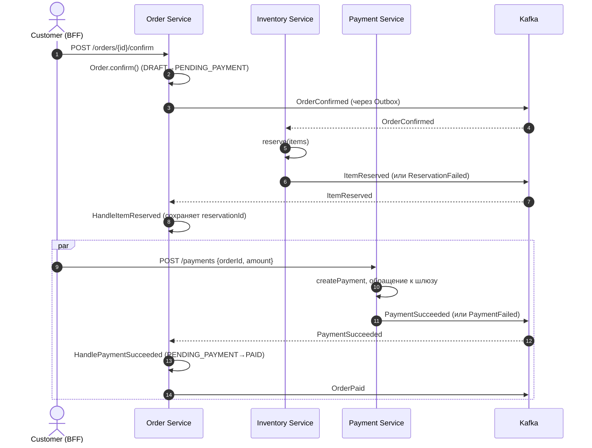
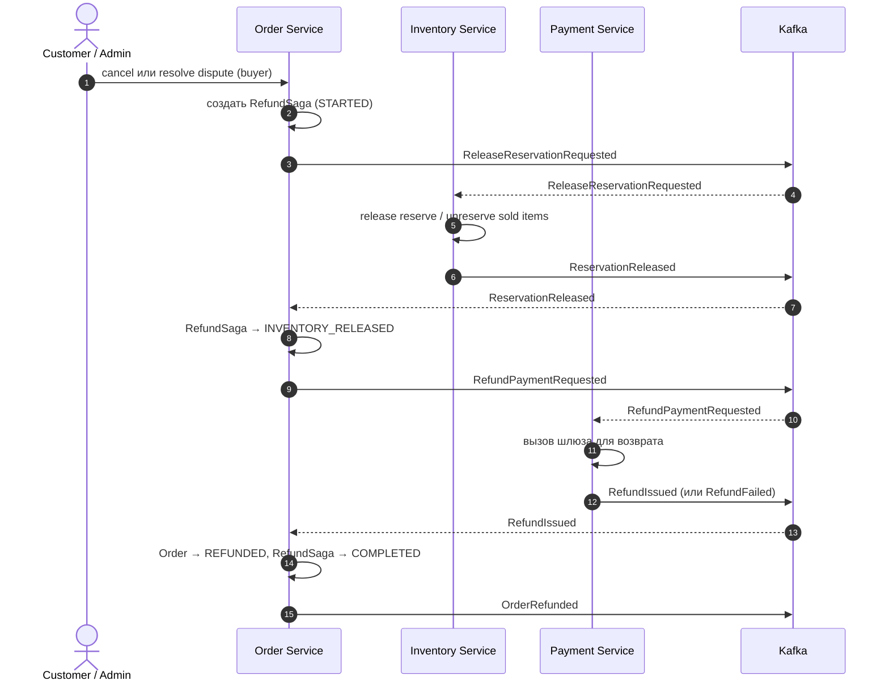

## 12. Saga / Process Manager

### Saga 1: Подтверждение заказа (Confirm Order)

**Цель**: Перевести заказ из `DRAFT` в `PAID` через резервирование остатка и оплату.

**Реализация**: orchestrated saga, состояние хранится в самом агрегате `Order` (`status` + `reservationId`). Координация — серия handler-ов `Order Service`.

**Шаги**:

**Компенсации**:

| Шаг | При ошибке | Компенсация |
|---|---|---|
| 5. `reserve` | `ReservationFailed` | `Order → DRAFT`, эмиссия `OrderReservationFailed`; ничего не нужно откатывать. |
| 11. `payment` | `PaymentFailed` | `Order → DRAFT`, асинхронно публикуется `OrderPaymentFailed`, Inventory подписан → снимает резерв. |
| 11. `payment` | таймаут 15 мин | `ExpireUnpaidOrdersJob` переводит `→ EXPIRED`, событие `OrderExpired` снимает резерв. |

**Идемпотентность**: каждый event handler хранит `processed_event_id`; повторный приём `ItemReserved`/`PaymentSucceeded` игнорируется (`BR-011`).

### Saga 2: Возврат денег (Process Refund)

**Цель**: Вернуть деньги покупателю после `CancelOrder` (для оплаченного заказа) или после `ResolveDisputeForBuyer`.

**Реализация**: orchestrated saga, состояние хранится в таблице `refund_sagas (id, order_id, status, started_at, completed_at)` со статусами `STARTED`, `INVENTORY_RELEASED`, `PAYMENT_REFUNDING`, `COMPLETED`, `FAILED`.

**Шаги**:

**Компенсации и обработка ошибок**:

| Ошибка | Реакция |
|---|---|
| `ReservationReleased` не приходит за 5 минут | retry от Outbox-relay (повторная публикация `ReleaseReservationRequested`); если 3 раза не пришёл — алёрт оператору, `RefundSaga → FAILED`, ручной разбор. |
| `RefundFailed` | `RefundSaga → FAILED`, `Order` остаётся в `CANCELLING` или `DISPUTE`, оператору в Admin BFF приходит таска. |
| Деньги уже выплачены продавцу (`BR-009`) | `Order → REFUNDED`, баланс продавца становится `−amount`, в следующем расчёте у него удержание. |

### Saga 3: Закрытие доставленных (Close Delivered)

**Не оркестрируемая saga, а scheduled job `CloseDeliveredOrdersJob`**.

- Запускается раз в день.
- `SELECT … FROM orders WHERE status = 'DELIVERED' AND delivered_at < now() - INTERVAL '14 days' FOR UPDATE SKIP LOCKED`.
- Для каждого: `Order → COMPLETED`, эмиссия `OrderCompleted`.
- Settlement подписан → начисляет выручку продавцу.

### Контракты Saga-сообщений

Все Saga-сообщения публикуются в топик `marketplace.orders.saga.v1` (отдельный от `marketplace.orders.v1`, чтобы не путать бизнес-события с операционными). Header `x-correlation-id` (= `orderId`) и `x-saga-id` обязательны.

### Стек

- Outbox-relay — Debezium + Kafka Connect, либо своя `@Scheduled` job, читающая `outbox WHERE published_at IS NULL`.
- Saga state — таблицы `refund_sagas`, без отдельного фреймворка (нет нужды в Camunda для этого объёма).
- Idempotent consumer — `processed_events`. См. [распределённые паттерны](https://vikulin-va.ru/distributed-patterns/).
