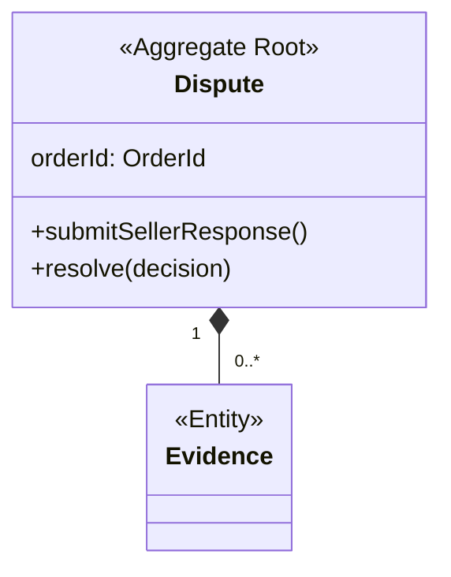
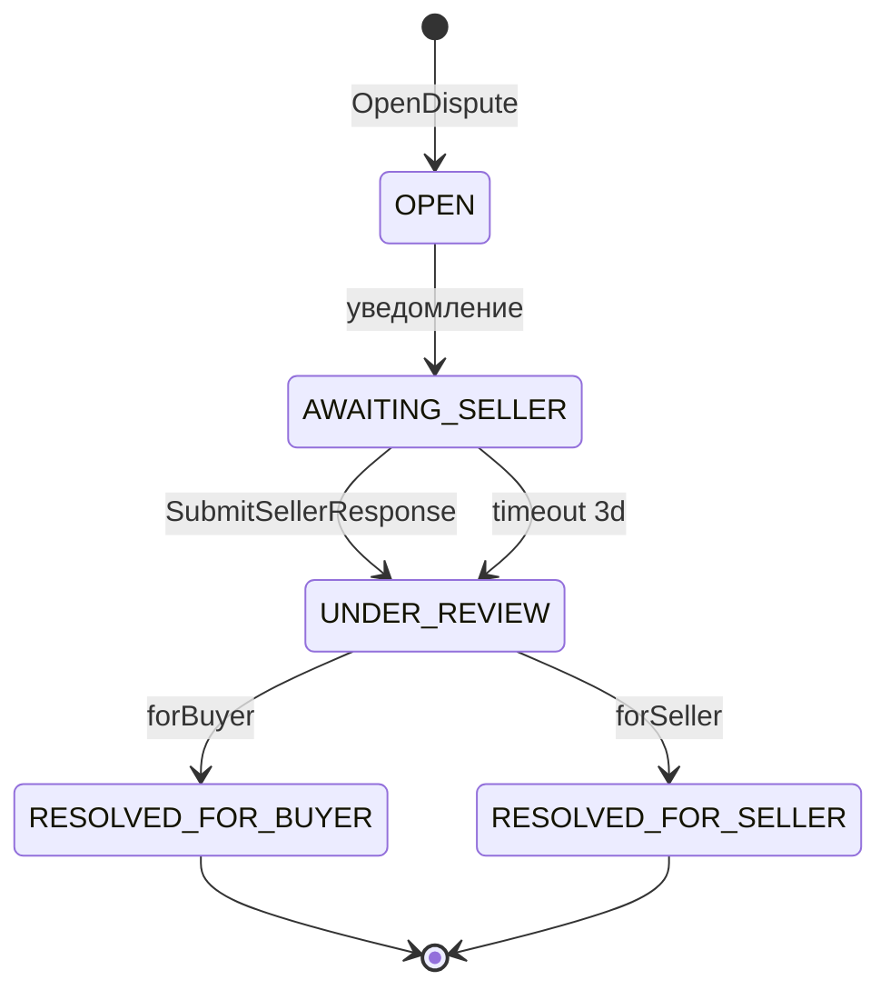

# Агрегат `Dispute`

Спор по доставленному заказу: разбирательство между покупателем и продавцом с решением оператора. Отдельный агрегат — у спора своя жизнь (ответ продавца в срок, вложения, вердикт), которая раньше раздувала `Order`. Ссылается на заказ по `orderId`; координируется с `Order` и `Refund` через события (корень → [Доменные события](../order-service-spec.md#5-доменные-события) и [Процессы](../order-service-spec.md#7-процессы)).

---

## 1. Доменная модель

Корень `Dispute`. Инварианты: один активный спор на заказ (`BR-D02`), окно открытия (`BR-D01`), срок ответа продавца (`BR-D03`).

| Элемент | Тип | Роль |
|---|---|---|
| `Dispute` | Aggregate Root | статус спора, причина, вложения, ответ продавца, решение |
| `Evidence` | Entity | вложение покупателя/продавца (фото, описание) |

### Value Objects

| VO | Инвариант |
|---|---|
| `DisputeId` | типизированный идентификатор |
| `DisputeReason` | enum: `NOT_DELIVERED` \| `DAMAGED` \| `NOT_AS_DESCRIBED` \| `OTHER` |
| `SellerResponse` | текст + признак согласия; задаётся один раз |
| `DisputeDecision` | enum: `FOR_BUYER` \| `FOR_SELLER` |

> `orderId` — ссылка на агрегат `Order` (по ID, не композиция).

---

## 2. Жизненный цикл

| Статус | Описание |
|---|---|
| `OPEN` | спор создан покупателем |
| `AWAITING_SELLER` | продавец уведомлён, есть 3 дня на ответ |
| `UNDER_REVIEW` | у оператора (продавец ответил либо срок истёк) |
| `RESOLVED_FOR_BUYER` | оператор решил в пользу покупателя → инициирует возврат |
| `RESOLVED_FOR_SELLER` | оператор решил в пользу продавца |

Терминальные: `RESOLVED_FOR_BUYER`, `RESOLVED_FOR_SELLER`.

### Матрица переходов

| Из | Триггер | В | Условие |
|---|---|---|---|
| ∅ | `OpenDispute` | `OPEN` | `BR-D01`, `BR-D02` |
| `OPEN` | (уведомление отправлено) | `AWAITING_SELLER` | автоматически |
| `AWAITING_SELLER` | `SubmitSellerResponse` | `UNDER_REVIEW` | продавец ответил |
| `AWAITING_SELLER` | истечение срока ответа | `UNDER_REVIEW` | 3 дня без ответа (`BR-D03`) |
| `UNDER_REVIEW` | `ResolveDisputeForBuyer` | `RESOLVED_FOR_BUYER` | вердикт оператора |
| `UNDER_REVIEW` | `ResolveDisputeForSeller` | `RESOLVED_FOR_SELLER` | вердикт оператора |

---

## 3. Доступ

Роли и ABAC-правила — [корень → Роли и доступ](../order-service-spec.md#4-роли-и-доступ); здесь — доступ к операциям `Dispute`.

| Операция | customer | seller | admin | ABAC |
|---|---|---|---|---|
| `OpenDispute` | ✅ | — | ✅ | владение заказом |
| `SubmitSellerResponse` | — | ✅ | — | продавец позиции в споре |
| `ResolveDispute` | — | — | ✅ | — (`BR-D04`) |
| `GetDispute` / `GetDisputesByOrder` | ✅ | ✅ | ✅ | участник спора / admin |
| `ListOpenDisputes` | — | — | ✅ | — |

---

## 4. Бизнес-правила

- **`BR-D01`** — *предусловие `OpenDispute`.* Спор открывается только покупателем и только в окне 14 дней после `Order.DELIVERED`. → `DISPUTE_WINDOW_CLOSED`.
- **`BR-D02`** — *инвариант.* На один заказ — не более одного активного спора. → `DISPUTE_ALREADY_OPEN`.
- **`BR-D03`** — *политика.* У продавца 3 дня на ответ; по истечении спор автоматически уходит `UNDER_REVIEW`.
- **`BR-D04`** — *предусловие `ResolveDispute`.* Решение выносит только `admin`. → `FORBIDDEN`.
- **`BR-D05`** — *инвариант.* Решение в пользу покупателя инициирует ровно один `Refund` по этому заказу.

---

## 5. Команды

### `OpenDispute`
- **Переход:** ∅ → `OPEN`
- **Вход:** `orderId`, причина, вложения
- **Предусловия:** `BR-D01`, `BR-D02`
- **Логика:** создать спор, прикрепить вложения; уведомить продавца, запустить срок ответа 3 дня.
- **Эмитит:** `DisputeOpened` · **Ошибки:** `DISPUTE_WINDOW_CLOSED`, `DISPUTE_ALREADY_OPEN`

### `SubmitSellerResponse`
- **Переход:** `AWAITING_SELLER` → `UNDER_REVIEW`
- **Вход:** текст ответа, признак согласия, вложения
- **Логика:** зафиксировать ответ продавца, передать оператору.
- **Эмитит:** `SellerResponded` · **Ошибки:** `DISPUTE_INVALID_STATE`, `FORBIDDEN`

### `ResolveDispute`
- **Переход:** `UNDER_REVIEW` → `RESOLVED_FOR_BUYER` / `RESOLVED_FOR_SELLER`
- **Вход:** решение (`FOR_BUYER` / `FOR_SELLER`)
- **Логика:** в пользу покупателя → `DisputeResolved(buyer)` (инициирует `Refund`, `BR-D05`); в пользу продавца → `DisputeResolved(seller)` (`Order` → `COMPLETED`).
- **Эмитит:** `DisputeResolved` · **Ошибки:** `DISPUTE_INVALID_STATE`, `FORBIDDEN`

---

## 6. Доменные события

| Событие | Триггер | Scope | Подписчики |
|---|---|---|---|
| `DisputeOpened` | `OpenDispute` | внешнее | Notification (продавцу), `Order` |
| `SellerResponded` | `SubmitSellerResponse` | внутреннее | Admin BFF |
| `DisputeResolved` | `ResolveDispute` | внешнее | Notification, `Order`, `Refund` (в пользу покупателя) |

---

## 7. Запросы

### `GetDispute`
- **Вопрос:** что со спором?
- **Параметры:** `disputeId`
- **Возвращает:** спор с историей и вложениями
- **Логика:** доступ — участник спора / admin.

### `ListOpenDisputes`
- **Вопрос:** какие споры ждут решения?
- **Параметры:** период?, страница
- **Возвращает:** очередь споров в `UNDER_REVIEW`
- **Логика:** из представления `DisputeQueue`; фильтр `UNDER_REVIEW`, сортировка по дате открытия.

### `GetDisputesByOrder`
- **Вопрос:** какие споры по заказу?
- **Параметры:** `orderId`
- **Возвращает:** споры по заказу
- **Логика:** фильтр по `orderId`; доступ — участник / admin.

**Read Model.** `DisputeQueue` (очередь оператора) строится из событий спора — согласованность в конечном счёте.
