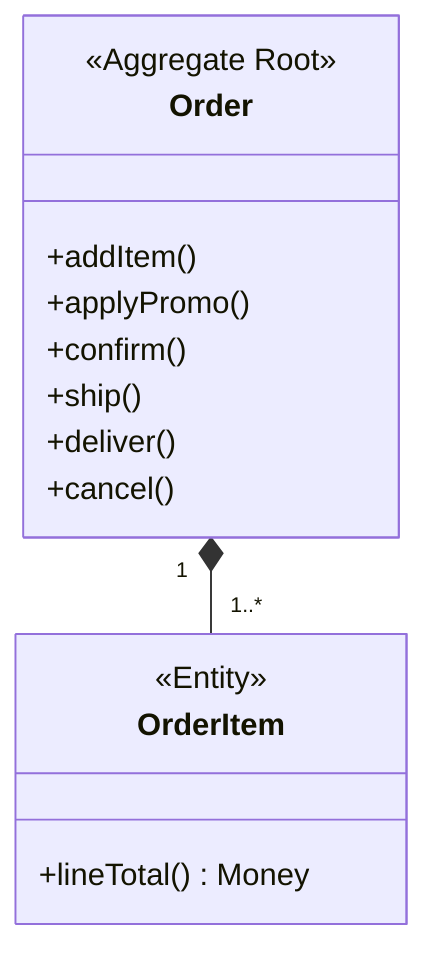
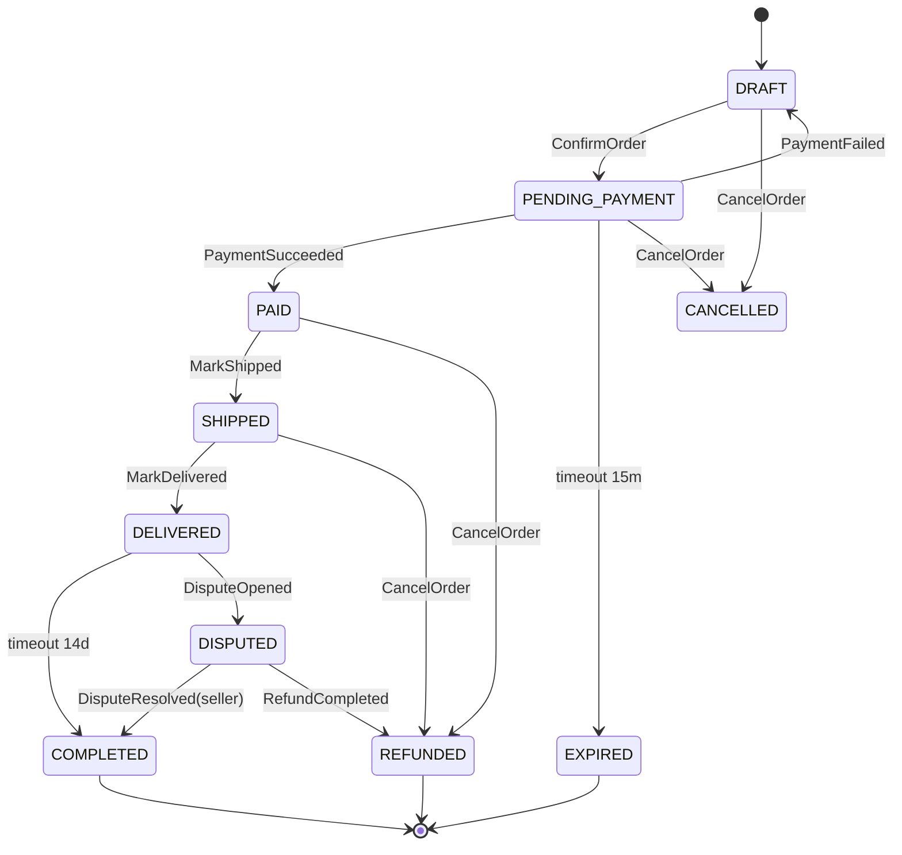

# Агрегат `Order`

Корень оформления заказа. Координирует резерв, оплату и доставку; делегирует спор агрегату `Dispute`, а возврат денег — агрегату `Refund` (по `orderId`). Секции — уровня агрегата; контекст-секции (язык, роли, события, интеграции) — в [корне](../order-service-spec.md).

---

## 1. Доменная модель

Корень `Order`. Инварианты: согласованность суммы (`BR-O01`), валидность переходов (см. [Жизненный цикл](#2-жизненный-цикл)), отсутствие дублей позиций по `(productId, sellerId)`. Граница транзакции = граница агрегата.

| Элемент | Тип | Роль |
|---|---|---|
| `Order` | Aggregate Root | позиции, статус, сумма, ссылки на резерв и платёж |
| `OrderItem` | Entity | позиция; уникальна по `(productId, sellerId)`; не существует вне `Order` |

### Value Objects

| VO | Инвариант |
|---|---|
| `Money` | сумма + валюта (RUB); immutable; не отрицательна |
| `Quantity` | целое 1..999 |
| `Discount` | sealed: `PercentageDiscount` \| `FixedDiscount` |
| `OrderStatus` | фаза жизненного цикла (см. [Жизненный цикл](#2-жизненный-цикл)) |
| `Address` | адрес доставки; **PII** |
| `OrderId`/`CustomerId`/`SellerId`/`ProductId` | типизированные идентификаторы |

> `Dispute` и `Refund` — соседние агрегаты, не часть `Order`; связь по `orderId`. Схема хранения — [корень → Техническая реализация](../order-service-spec.md#11-техническая-реализация).

---

## 2. Жизненный цикл

| Статус | Описание |
|---|---|
| `DRAFT` | создан, можно менять позиции |
| `PENDING_PAYMENT` | резерв успешен, ждём оплату (15 мин) |
| `PAID` | платёж подтверждён |
| `SHIPPED` | передан в доставку |
| `DELIVERED` | вручён; открыто окно спора 14 дней |
| `DISPUTED` | по заказу активен спор (агрегат `Dispute`) |
| `COMPLETED` | закрыт (окно споров истекло либо спор в пользу продавца) |
| `EXPIRED` | оплата не поступила вовремя |
| `CANCELLED` | отменён до отправки |
| `REFUNDED` | деньги возвращены (агрегат `Refund` завершён) |

Терминальные: `COMPLETED`, `EXPIRED`, `REFUNDED`.

### Матрица переходов

| Из | Триггер | В | Условие |
|---|---|---|---|
| `DRAFT` | `ConfirmOrder` | `PENDING_PAYMENT` | резерв подтверждён; ≥1 позиции; `BR-O02` |
| `PENDING_PAYMENT` | событие `PaymentSucceeded` | `PAID` | `BR-O08` |
| `PENDING_PAYMENT` | событие `PaymentFailed` | `DRAFT` | резерв снят |
| `PENDING_PAYMENT` | таймаут оплаты | `EXPIRED` | не оплачен за 15 мин |
| `PAID` | `MarkShipped` | `SHIPPED` | `BR-O05` |
| `SHIPPED` | `MarkDelivered` | `DELIVERED` | открывает окно спора 14 дней |
| `DELIVERED` | истечение окна спора | `COMPLETED` | спор не открыт за 14 дней |
| `DELIVERED` | событие `DisputeOpened` | `DISPUTED` | спор создан (агрегат `Dispute`) |
| `DISPUTED` | событие `DisputeResolved(seller)` | `COMPLETED` | решение в пользу продавца |
| `DISPUTED` | событие `RefundCompleted` | `REFUNDED` | возврат завершён (после решения в пользу покупателя) |
| `PAID`, `SHIPPED` | `CancelOrder` | `REFUNDED` | через `Refund` (`BR-O06`) |
| `DRAFT`, `PENDING_PAYMENT` | `CancelOrder` | `CANCELLED` | деньги не списаны |

---

## 3. Доступ

Роли и ABAC-правила — [корень → Роли и доступ](../order-service-spec.md#4-роли-и-доступ); здесь — доступ к операциям `Order`.

| Операция | customer | seller | admin | system | ABAC |
|---|---|---|---|---|---|
| `CreateOrder` | ✅ | — | ✅ | — | `customerId == jwt.sub` (кроме admin) |
| `AddItem` / `RemoveItem` | ✅ | — | ✅ | — | владение |
| `ApplyPromo` / `RemovePromo` | ✅ | — | — | — | владение |
| `ConfirmOrder` | ✅ | — | ✅ | — | владение |
| `CancelOrder` | ✅ | — | ✅ | — | владение |
| `MarkShipped` | — | ✅ | ✅ | — | заказ содержит товар продавца |
| `MarkDelivered` | — | — | ✅ | ✅ | system = логистика |
| `GetOrderById` / `GetOrderTimeline` | ✅ | ✅ | ✅ | — | свой / содержит товар / admin |
| `SearchMyOrders` | ✅ | — | ✅ | — | только свои |
| `SearchSellerOrders` | — | ✅ | ✅ | — | товар продавца |

---

## 4. Бизнес-правила

- **`BR-O01`** — *инвариант.* `total = Σ lineTotal − discount + shippingFee`. → `INTERNAL_ERROR`.
- **`BR-O02`** — *предусловие `ConfirmOrder`.* Резерв обязателен перед `PENDING_PAYMENT`. → `OUT_OF_STOCK`.
- **`BR-O03`** — *инвариант.* Один промокод на заказ. → `PROMO_ALREADY_APPLIED`.
- **`BR-O04`** — *инвариант.* `unitPrice` фиксируется на момент оформления.
- **`BR-O05`** — *предусловие `MarkShipped`.* Только продавцу позиции. → `FORBIDDEN`.
- **`BR-O06`** — *предусловие `CancelOrder`.* Отмена оплаченного идёт через `Refund`. → `ORDER_INVALID_STATE`.
- **`BR-O07`** — *предусловие `CreateOrder`.* Идемпотентный ключ обязателен; повтор → прежний `orderId`. → `IDEMPOTENCY_KEY_CONFLICT`.
- **`BR-O08`** — *инвариант.* `PaymentSucceeded` обрабатывается ровно один раз.
- **`BR-O09`** — *инвариант.* `discount ≤ Σ items + shippingFee`; `total` не отрицателен.
- **`BR-O10`** — *предусловие `ConfirmOrder`.* `total ≥ 100 RUB`. → `ORDER_BELOW_MINIMUM`.
- **`BR-O11`** — *предусловие.* Один заказ → один продавец (V1). → `MULTI_SELLER_NOT_SUPPORTED`.
- **`BR-O12`** — *инвариант.* События публикуются атомарно с изменением состояния.

---

## 5. Команды

### `CreateOrder`
- **Переход:** ∅ → `DRAFT`
- **Вход:** позиции, адрес доставки, идемпотентный ключ
- **Предусловия:** `BR-O07`, `BR-O11`
- **Логика:** проверить идемпотентный ключ; уточнить у Catalog цены/наличие; создать `Order`; рассчитать `total` (`BR-O01`).
- **Эмитит:** `OrderCreated` · **Ошибки:** `PRODUCT_NOT_FOUND`, `MULTI_SELLER_NOT_SUPPORTED`

### `AddItem` / `RemoveItem`
- **Переход:** `DRAFT` → `DRAFT`
- **Логика:** изменить состав, пересчитать `total`. · **Ошибки:** `ORDER_INVALID_STATE`, `MULTI_SELLER_NOT_SUPPORTED`

### `ApplyPromo` / `RemovePromo`
- **Переход:** `DRAFT` → `DRAFT`
- **Предусловия:** `BR-O03`, `BR-O09`
- **Логика:** валидировать промокод у Catalog, применить/снять, пересчитать. · **Ошибки:** `PROMO_INVALID`, `PROMO_NOT_APPLICABLE`, `PROMO_ALREADY_APPLIED`

### `ConfirmOrder`
- **Переход:** `DRAFT` → `PENDING_PAYMENT`
- **Предусловия:** ≥1 позиции (`BR-O02`), `total ≥ 100` (`BR-O10`)
- **Логика:** перевести в `PENDING_PAYMENT`, опубликовать `OrderConfirmed`; Inventory резервирует асинхронно, параллельно инициируется платёж (корень → [Процессы](../order-service-spec.md#7-процессы)).
- **Эмитит:** `OrderConfirmed` · **Ошибки:** `ORDER_INVALID_STATE`, `ORDER_BELOW_MINIMUM`, `EMPTY_ORDER`

### `MarkShipped`
- **Переход:** `PAID` → `SHIPPED`
- **Вход:** трек-номер · **Предусловия:** `BR-O05`
- **Эмитит:** `OrderShipped` · **Ошибки:** `ORDER_INVALID_STATE`, `FORBIDDEN`

### `MarkDelivered`
- **Переход:** `SHIPPED` → `DELIVERED`
- **Логика:** открывает окно спора 14 дней. · **Эмитит:** `OrderDelivered` · **Ошибки:** `ORDER_INVALID_STATE`

### `CancelOrder`
- **Переход:** до отправки → `CANCELLED`; оплаченного → `REFUNDED` (через `Refund`)
- **Предусловия:** `BR-O06`
- **Логика:** в `DRAFT`/`PENDING_PAYMENT` — снять резерв, закрыть; в `PAID`/`SHIPPED` — `RequestRefund` (агрегат `Refund`).
- **Эмитит:** `OrderCancelled` · **Ошибки:** `ORDER_INVALID_STATE`

---

## 6. Доменные события

| Событие | Триггер | Scope | Подписчики |
|---|---|---|---|
| `OrderCreated` | `CreateOrder` | внутреннее | Read Model |
| `OrderConfirmed` | `ConfirmOrder` | внешнее | Inventory, Notification |
| `OrderReservationFailed` | неудача резерва | внешнее | Notification |
| `OrderPaid` | успешный платёж | внешнее | Notification, Inventory, Settlement |
| `OrderPaymentFailed` | неуспешный платёж | внешнее | Inventory |
| `OrderShipped` | `MarkShipped` | внешнее | Notification |
| `OrderDelivered` | `MarkDelivered` | внешнее | Notification |
| `OrderCompleted` | закрытие / спор в пользу продавца | внешнее | Settlement |
| `OrderCancelled` | `CancelOrder` | внешнее | Inventory, Notification |
| `OrderExpired` | истечение оплаты | внешнее | Inventory |
| `OrderDisputed` | реакция на `DisputeOpened` | внутреннее | Read Model |
| `OrderRefunded` | реакция на `RefundCompleted` | внешнее | Settlement, Notification |

---

## 7. Запросы

### `GetOrderById`
- **Вопрос:** что с этим заказом?
- **Параметры:** `orderId`
- **Возвращает:** полное представление заказа
- **Логика:** читает согласованное представление (write-side) для read-your-own-writes; доступ по ABAC.

### `SearchMyOrders`
- **Вопрос:** какие у меня заказы?
- **Параметры:** статус?, период?, страница
- **Возвращает:** список сводок заказов
- **Логика:** из представления `OrderSummary`; фильтр `customerId == jwt.sub`; согласованность в конечном счёте.

### `SearchSellerOrders`
- **Вопрос:** какие заказы с моими товарами?
- **Параметры:** статус?, период?, страница
- **Возвращает:** список сводок заказов
- **Логика:** из `OrderSummary`; фильтр по позициям продавца (`sellerId`); согласованность в конечном счёте.

### `GetOrderTimeline`
- **Вопрос:** как менялся заказ?
- **Параметры:** `orderId`
- **Возвращает:** историю переходов состояний
- **Логика:** из представления `OrderTimeline` по `orderId`.

**Read Model.** `OrderSummary` и `OrderTimeline` строятся из доменных событий (корень → [Доменные события](../order-service-spec.md#5-доменные-события)) — согласованы в конечном счёте. Critical-path читает согласованное представление.
