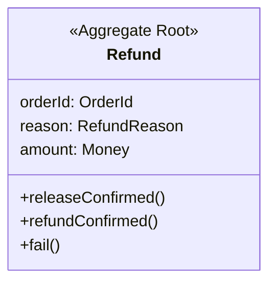
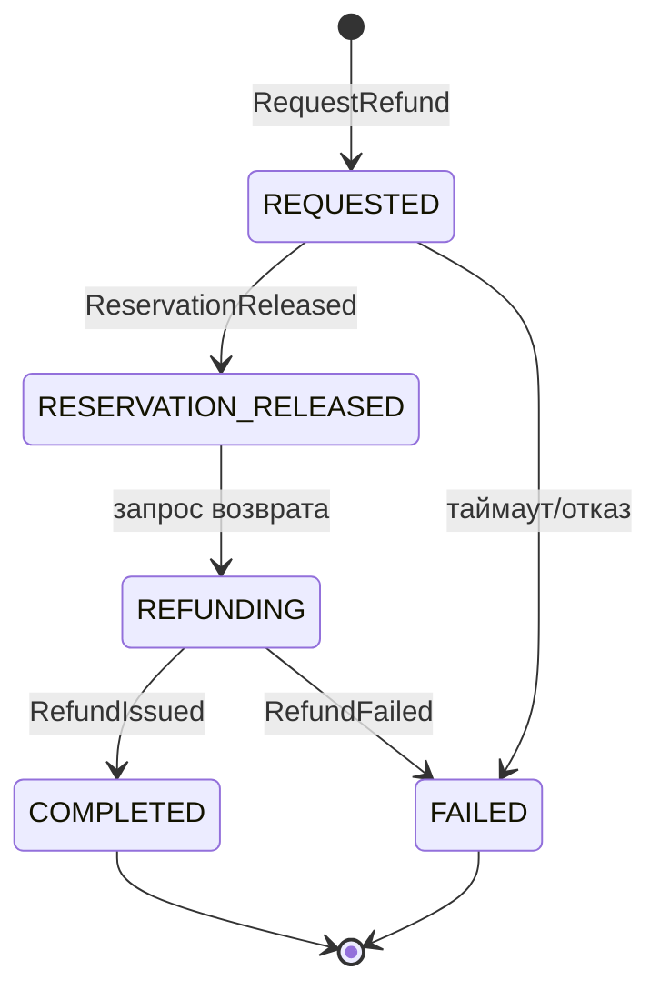

# Агрегат `Refund`

Процесс возврата денег покупателю: снятие резерва в Inventory → возврат средств через Payment. Отдельный агрегат-процесс (раньше — saga в `refund_sagas`) со своим жизненным циклом, компенсациями и таймаутами. Ссылается на заказ по `orderId`; по завершении сообщает `Order` событием `RefundCompleted` (корень → [Доменные события](../order-service-spec.md#5-доменные-события) и [Процессы](../order-service-spec.md#7-процессы)).

---

## 1. Доменная модель

Корень `Refund` — долгоживущий процесс. Инварианты: возврат только для оплаченного заказа (`BR-R01`), идемпотентность шагов (`BR-R03`).

| Элемент | Тип | Роль |
|---|---|---|
| `Refund` | Aggregate Root | статус процесса, причина, суммы, отметки шагов |

### Value Objects

| VO | Инвариант |
|---|---|
| `RefundId` | типизированный идентификатор |
| `RefundReason` | enum: `CANCELLED` \| `DISPUTE_BUYER` |
| `Money` | сумма возврата; не отрицательна |

> `orderId` — ссылка на агрегат `Order` (по ID).

---

## 2. Жизненный цикл

| Статус | Описание |
|---|---|
| `REQUESTED` | процесс создан, нужно снять резерв и вернуть деньги |
| `RESERVATION_RELEASED` | резерв в Inventory снят |
| `REFUNDING` | запрошен возврат средств у Payment |
| `COMPLETED` | деньги возвращены |
| `FAILED` | процесс не завершился — нужен ручной разбор |

Терминальные: `COMPLETED`, `FAILED`.

### Матрица переходов

| Из | Триггер | В | Условие |
|---|---|---|---|
| ∅ | `RequestRefund` | `REQUESTED` | `BR-R01` |
| `REQUESTED` | событие `ReservationReleased` | `RESERVATION_RELEASED` | резерв снят |
| `RESERVATION_RELEASED` | (запрос возврата) | `REFUNDING` | автоматически |
| `REFUNDING` | событие `RefundIssued` | `COMPLETED` | деньги вернулись |
| `REQUESTED`, `REFUNDING` | таймаут / отказ | `FAILED` | `BR-R03` |

---

## 3. Доступ

Роли и ABAC-правила — [корень → Роли и доступ](../order-service-spec.md#4-роли-и-доступ); здесь — доступ к операциям `Refund`.

| Операция | customer | admin | system | ABAC |
|---|---|---|---|---|
| `RequestRefund` | — | ✅ | ✅ | инициируется системой/оператором (`BR-R01`) |
| `GetRefund` | — | ✅ | — | admin |
| `GetRefundByOrder` | ✅ | ✅ | — | владелец заказа / admin |

---

## 4. Бизнес-правила

- **`BR-R01`** — *предусловие `RequestRefund`.* Возврат инициируется только для оплаченного заказа (`Order` в `PAID`/`SHIPPED`/`DISPUTED`).
- **`BR-R02`** — *инвариант.* Если выплата продавцу уже исполнена — при возврате баланс продавца уходит в минус (удержание в следующем расчёте Settlement).
- **`BR-R03`** — *политика.* Шаги идемпотентны; неподтверждение шага за 5 мин — повтор; после 3 неудач → `FAILED` + эскалация оператору.
- **`BR-R04`** — *инвариант.* На один заказ — не более одного незавершённого `Refund`.

---

## 5. Команды

### `RequestRefund`
- **Переход:** ∅ → `REQUESTED`
- **Вход:** `orderId`, причина (`CANCELLED` / `DISPUTE_BUYER`), сумма
- **Предусловия:** `BR-R01`, `BR-R04`
- **Логика:** создать процесс; запросить снятие резерва у Inventory.
- **Эмитит:** `RefundRequested` · **Ошибки:** `REFUND_NOT_ALLOWED`, `REFUND_ALREADY_IN_PROGRESS`

> `RequestRefund` инициируется из `Order`: при `CancelOrder` оплаченного заказа и при `DisputeResolved(buyer)` (`BR-D05`). Прохождение шагов (снятие резерва, возврат средств, таймауты/повторы по `BR-R03`) — в [Жизненном цикле](#2-жизненный-цикл). По `RefundCompleted` `Order` переходит в `REFUNDED`.

---

## 6. Доменные события

| Событие | Триггер | Scope | Подписчики |
|---|---|---|---|
| `RefundRequested` | `RequestRefund` | внутреннее | — |
| `RefundCompleted` | завершение процесса | внешнее | `Order`, Settlement |
| `RefundFailed` | сбой процесса | внутреннее | Admin BFF |

---

## 7. Запросы

### `GetRefund`
- **Вопрос:** что с процессом возврата?
- **Параметры:** `refundId`
- **Возвращает:** процесс возврата со статусом и отметками шагов
- **Логика:** доступ — admin.

### `GetRefundByOrder`
- **Вопрос:** есть ли возврат по заказу и в каком он статусе?
- **Параметры:** `orderId`
- **Возвращает:** возврат по заказу (статус для покупателя)
- **Логика:** фильтр по `orderId`; покупателю — только статус; доступ — владелец заказа / admin.

**Read Model.** Статус возврата проецируется в таймлайн заказа (`OrderTimeline`, см. [`order.md` → Запросы](order.md#7-запросы)).
