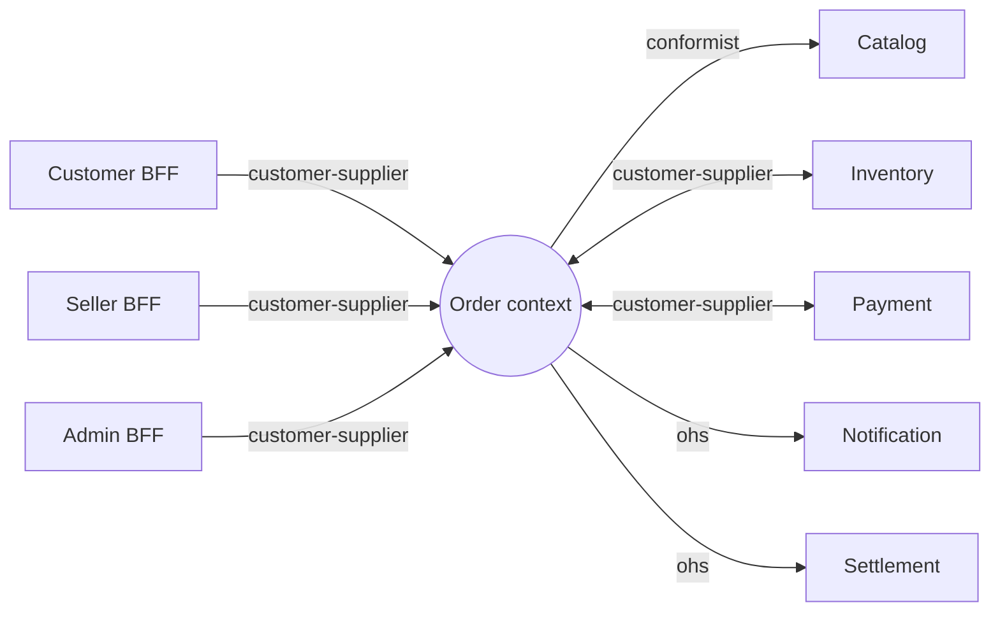
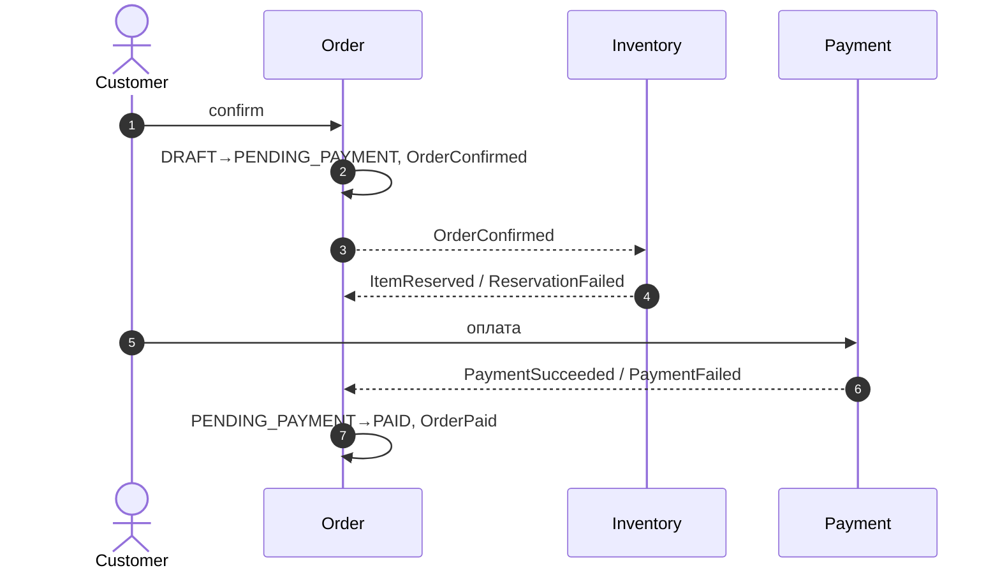
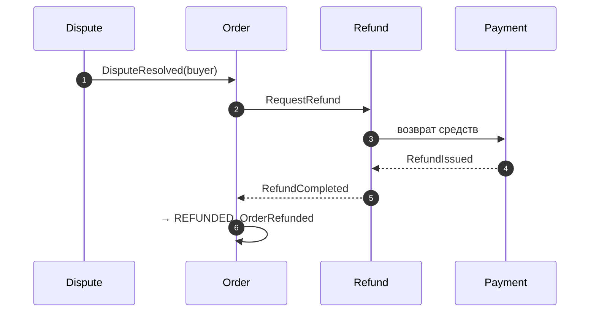
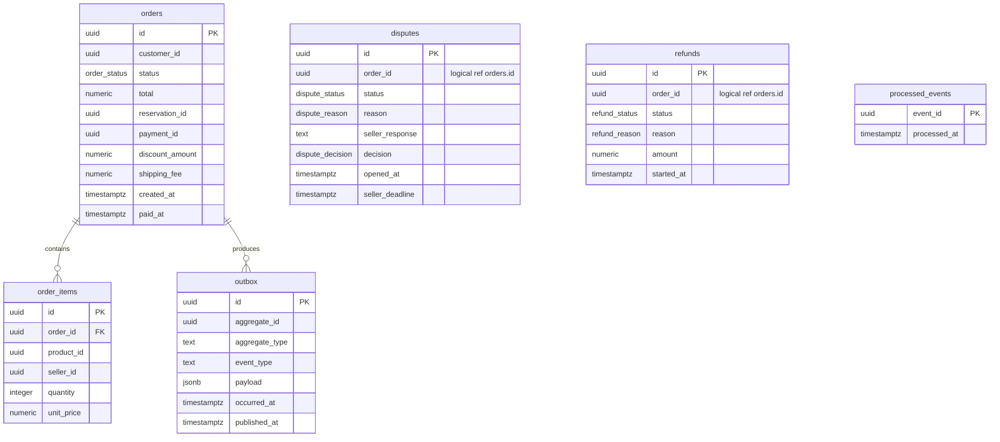

# Order Service — спецификация Bounded Context «Order» (Уровень 3)

> **Корневой файл контекста.** Здесь — секции уровня **контекста** (общие для всех агрегатов).
> Секции уровня **агрегата** (Доменная модель, Жизненный цикл, Доступ, Бизнес-правила, Команды,
> События, Запросы) — по файлу на агрегат в `aggregates/`:
> [`order.md`](aggregates/order.md) · [`dispute.md`](aggregates/dispute.md) · [`refund.md`](aggregates/refund.md).
>
> Спека описывает **только контекст Order** и **в доменных терминах**; техника — в разделе
> [Техническая реализация](#11-техническая-реализация). Соседние контексты — лишь рёбра на стыке
> (раздел [Интеграции](#2-интеграции)); полная Context Map — артефакт уровня домена.

---

## 1. Bounded Context

**Контекст:** Order. **Субдомен:** Ordering — **Core**. **Владелец:** команда order-team. **Миссия:** довести заказ от черновика до закрытия, удерживая согласованность денег, резерва и состояния.

**Агрегаты контекста:**

| Агрегат | Роль | Файл |
|---|---|---|
| `Order` | корень оформления: позиции, сумма, статусы, координация резерва/оплаты/доставки | [`order.md`](aggregates/order.md) |
| `Dispute` | спор после доставки: ответ продавца, решение оператора | [`dispute.md`](aggregates/dispute.md) |
| `Refund` | процесс возврата денег: снятие резерва → возврат средств | [`refund.md`](aggregates/refund.md) |

Агрегаты — отдельные границы транзакций; ссылаются друг на друга **только по ID** (`orderId`) и координируются через доменные события (см. [Доменные события](#5-доменные-события) и [Процессы](#7-процессы)).

**Внутри границы (контекст владеет):** жизненный цикл заказа, спор и возврат на стороне заказа, публикация доменных событий.
**Вне границы:** каталог и цены (Catalog), движение остатка (Inventory), платёжные шлюзы (Payment), расчёты с продавцами (Settlement), аутентификация (Keycloak).

**Стыки контекста** (схема и детали — [Интеграции](#2-интеграции); полная Context Map — на уровне домена): Order — *supplier* для Customer/Seller/Admin BFF; *conformist* к Catalog; *customer-supplier* с Inventory и Payment; *open host service* для Notification и Settlement.

---

## 2. Интеграции

*Context Map — рёбра со стороны контекста Order.* Полная Context Map — на уровне домена.

Нормализованный словарь: `направление` ∈ `inbound|outbound|bidirectional`; `канал` ∈ `sync|async|sync+async`; `связь` ∈ `customer-supplier|conformist|ohs`.

| Ребро | Направление | Канал | Связь | Передаётся |
|---|---|---|---|---|
| Customer BFF | inbound | sync | customer-supplier | команды покупателя, спор |
| Seller BFF | inbound | sync | customer-supplier | `MarkShipped`, `SubmitSellerResponse`, поиск |
| Admin BFF | inbound | sync | customer-supplier | `ResolveDispute`, очередь споров |
| Catalog | outbound | sync | conformist | цены, наличие товара |
| Inventory | bidirectional | async | customer-supplier | publish `OrderConfirmed`/`OrderCancelled`/`OrderExpired`; consume `ItemReserved`/`ReservationFailed`/`ReservationReleased` |
| Payment | bidirectional | sync+async | customer-supplier | запрос оплаты/возврата; consume `PaymentSucceeded`/`PaymentFailed`/`RefundIssued` |
| Notification | outbound | async | ohs | события заказа и спора |
| Settlement | outbound | async | ohs | `OrderPaid`/`OrderCompleted`/`OrderRefunded` |

На inbound-рёбрах Order — *supplier*. Гарантии async-доставки: at-least-once + идемпотентный приём. Каналы и топики — [Техническая реализация](#11-техническая-реализация).

### Контракты

REST → OpenAPI-файл, Kafka → AsyncAPI-файл. В спеке — только ссылка на файл; сам контракт ведётся отдельно. Владелец определяется типом связи: для *conformist* (Catalog) и потребляемых событий — upstream-контекст; для своих REST и публикуемых событий (*ohs*) — Order.

| Контракт | Формат | Файл | Владелец |
|---|---|---|---|
| Order REST API (inbound от BFF) | OpenAPI | [`contracts/order-api.openapi.yaml`](../contracts/order-api.openapi.yaml) | Order |
| Публикуемые события Order | AsyncAPI | [`contracts/order-events.asyncapi.yaml`](../contracts/order-events.asyncapi.yaml) | Order |
| Catalog API | OpenAPI | контракт контекста Catalog (внешний реестр) | Catalog |
| Payment API | OpenAPI | контракт контекста Payment (внешний реестр) | Payment |
| Payment / Inventory события | AsyncAPI | контракты контекстов Payment / Inventory (внешний реестр) | Payment / Inventory |

---

## 3. Ubiquitous Language

Термины **в значении контекста Order**.

| Термин (рус) | В коде | Определение |
|---|---|---|
| Заказ | `Order` | Финансово-обязывающий документ. Корень агрегата. |
| Позиция заказа | `OrderItem` | Товар × количество × цена на момент покупки. Сущность внутри `Order`. |
| Сумма заказа | `Money total` | Сумма позиций − скидка + доставка. Вычисляется. |
| Резерв | `Reservation` | Блокировка остатка в Inventory под заказ до оплаты. |
| Статус заказа | `OrderStatus` | Фаза жизненного цикла `Order`. |
| Спор | `Dispute` | Отдельный агрегат: разбирательство после доставки. |
| Ответ продавца | `SellerResponse` | Реакция продавца на спор в течение 3 дней. |
| Решение по спору | `DisputeDecision` | Вердикт оператора: в пользу покупателя / продавца. |
| Возврат | `Refund` | Отдельный агрегат: процесс возврата денег покупателю. |
| Доменное событие | `DomainEvent` | Факт в агрегате; публикуется наружу. |
| Идемпотентный ключ | `IdempotencyKey` | Защита от повторного создания заказа. |

**Не путать:** Корзина ≠ Заказ · Платёж ≠ Заказ · Отмена ≠ Возврат · Резерв ≠ Списание · Спор ≠ Возврат (спор может закончиться в пользу продавца — без возврата).

---

## 4. Роли и доступ

| Роль | Кто |
|---|---|
| `customer` | покупатель |
| `seller` | продавец |
| `admin` | оператор маркетплейса |
| `system` | внутренние сервисы (Payment, Inventory, логистика) |

**ABAC-правила (общие для контекста):** владение покупателя ⇔ `order.customerId == jwt.sub`; доступ продавца ⇔ `∃ OrderItem.sellerId == jwt.sub`; admin — полный доступ.

Доступ к конкретным операциям (роль × операция) — в разделе «Доступ» каждого агрегата: [`order.md`](aggregates/order.md#3-доступ), [`dispute.md`](aggregates/dispute.md#3-доступ), [`refund.md`](aggregates/refund.md#3-доступ).

**PII:** `Address` (в `Order`) — персональные данные, шифрование хранения. `email`/`phone` не хранятся.

---

## 5. Доменные события

*Контракт публикуемого языка.* События **владеются агрегатами** — полное описание (триггер, scope, подписчики) в разделе «Доменные события» каждого агрегата. Наружу контекст публикует только перечисленные ниже **внешние** события; внутренние события контекст не покидают. Топики и версионирование — [Техническая реализация](#11-техническая-реализация).

| Агрегат | Внешние события | Топик |
|---|---|---|
| `Order` | `OrderConfirmed`, `OrderReservationFailed`, `OrderPaid`, `OrderPaymentFailed`, `OrderShipped`, `OrderDelivered`, `OrderCompleted`, `OrderCancelled`, `OrderExpired`, `OrderRefunded` | `marketplace.orders.v1` |
| `Dispute` | `DisputeOpened`, `DisputeResolved` | `marketplace.disputes.v1` |
| `Refund` | `RefundCompleted` | `marketplace.refunds.v1` |

Кто потребляет каждое событие (рёбра наружу) — [Интеграции](#2-интеграции); внутриконтекстная реакция между агрегатами — [Процессы](#7-процессы) и матрицы переходов в файлах агрегатов.

---

## 6. Use Cases

*Сквозные сценарии — пересекают несколько агрегатов, поэтому на уровне контекста.*

### UC-1 Покупка (happy path)

- **Актор:** customer · **Триггер:** «Оформить заказ» из корзины · **Агрегаты:** `Order`
- **Основной поток:** `CreateOrder` → `DRAFT` → `ConfirmOrder` → `PENDING_PAYMENT` (`OrderConfirmed`) → Inventory резервирует (`ItemReserved`) → оплата (`PaymentSucceeded`) → `PAID` (`OrderPaid`) → `MarkShipped` → `SHIPPED` → `MarkDelivered` → `DELIVERED` → через 14 дней → `COMPLETED`.
- **Альтернативы:** `ReservationFailed` → `DRAFT`; `PaymentFailed` → `DRAFT`; уход с оплаты → `EXPIRED` (15 мин).

### UC-2 Отмена до отправки

- **Актор:** customer · **Агрегаты:** `Order` → `Refund`
- **Основной поток:** `Order.CancelOrder` оплаченного → создаётся `Refund` → `RefundCompleted` → `Order` `REFUNDED`.
- **Альтернатива:** до оплаты (`DRAFT`/`PENDING_PAYMENT`) → `CANCELLED` без возврата.

### UC-3 Спор → возврат

- **Актор:** customer (спор), seller (ответ), admin (решение) · **Агрегаты:** `Order` → `Dispute` → `Refund`
- **Основной поток:**
  1. `Order` в `DELIVERED`.
  2. `Dispute.OpenDispute` → `OPEN`; `Order` реагирует → `DISPUTED`.
  3. `Dispute.SubmitSellerResponse` либо таймаут 3 дня → `UNDER_REVIEW`.
  4. `Dispute.ResolveDispute`.
- **Альтернативы:**
  - в пользу покупателя → `DisputeResolved(buyer)` → создаётся `Refund` → `RefundCompleted` → `Order` `REFUNDED`;
  - в пользу продавца → `DisputeResolved(seller)` → `Order` `COMPLETED`.

### UC-4 Продавец отмечает отправку

- **Актор:** seller · **Агрегаты:** `Order`
- **Основной поток:** `Order.MarkShipped` (трек-номер) → `SHIPPED` (`OrderShipped`); Notification уведомляет покупателя.

### UC-5 Покупатель смотрит свои заказы

- **Актор:** customer · **Агрегаты:** `Order`
- **Основной поток:** `Order.SearchMyOrders` → список сводок (только свои).

### UC-6 Продавец смотрит свои заказы

- **Актор:** seller · **Агрегаты:** `Order`
- **Основной поток:** `Order.SearchSellerOrders` → список сводок (только с товаром продавца).

### UC-7 Оператор разбирает споры

- **Актор:** admin · **Агрегаты:** `Dispute`
- **Основной поток:** `Dispute.ListOpenDisputes` (очередь) → `Dispute.GetDispute` → `Dispute.ResolveDispute`.

---

## 7. Процессы

*Saga / Process Manager — кросс-агрегатные процессы.*

**Процесс «Подтверждение»** (внутри `Order`, координирует Inventory + Payment):

**Процесс «Спор → Возврат»** (агрегаты `Dispute` → `Order` → `Refund`):

Компенсации и таймауты — в «Бизнес-правилах» агрегатов ([`refund.md`](aggregates/refund.md#4-бизнес-правила), [`dispute.md`](aggregates/dispute.md#4-бизнес-правила)). Гарантии: идемпотентный приём, атомарная публикация событий.

---

## 8. UI-спецификация

Order Service UI не имеет — экраны в Customer/Seller/Admin BFF.

| Статус `Order` | Бейдж | Цвет |
|---|---|---|
| `DRAFT` | Черновик | серый |
| `PENDING_PAYMENT` | Ожидает оплаты | жёлтый |
| `PAID` | Оплачен | синий |
| `SHIPPED` | Отправлен | фиолетовый |
| `DELIVERED` | Доставлен | зелёный |
| `COMPLETED` | Завершён | тёмно-зелёный |
| `EXPIRED` | Истёк | тёмно-серый |
| `CANCELLED` | Отменён | тёмно-серый |
| `DISPUTED` | Спор | красный |
| `REFUNDED` | Возврат | серо-синий |

### Тексты ошибок для пользователя

| Код ошибки (из «Команд» агрегатов) | Текст |
|---|---|
| `OUT_OF_STOCK` | Один из товаров закончился. |
| `PRODUCT_NOT_FOUND` | Этот товар больше не продаётся. |
| `ORDER_INVALID_STATE` | Действие недоступно для этого заказа. |
| `ORDER_BELOW_MINIMUM` | Минимальная сумма заказа — 100 ₽. |
| `MULTI_SELLER_NOT_SUPPORTED` | В одном заказе товары только одного продавца. |
| `PROMO_ALREADY_APPLIED` | К этому заказу уже применён промокод. |
| `DISPUTE_WINDOW_CLOSED` | Срок открытия спора истёк (14 дней). |
| `DISPUTE_ALREADY_OPEN` | По этому заказу уже открыт спор. |
| `FORBIDDEN` | Этот заказ недоступен. |

---

## 9. Критерии приёмки

*Given / When / Then.*

### UC-1 — Покупка

- **Given** корзина одного продавца · **When** оформление + подтверждение + оплата · **Then** `DRAFT → PENDING_PAYMENT → PAID`, публикуется `OrderPaid`.
- **Given** тот же идемпотентный ключ · **When** повторное создание · **Then** прежний `orderId`, без дубля (`BR-O07`).
- **Given** доставлен, спор не открыт · **When** прошло 14 дней · **Then** `COMPLETED`.

### UC-2 — Отмена

- **Given** оплаченный заказ · **When** покупатель отменяет · **Then** создаётся `Refund`; `OrderRefunded` только после `RefundCompleted`; `Order` → `REFUNDED`.

### UC-3 — Спор

- **Given** доставленный заказ в окне 14 дней · **When** покупатель открывает спор · **Then** создаётся `Dispute` в `OPEN`, `Order` → `DISPUTED`, продавец уведомлён.
- **Given** заказ доставлен >14 дней назад · **When** попытка открыть спор · **Then** `DISPUTE_WINDOW_CLOSED` (`BR-D01`).
- **Given** спор в `AWAITING_SELLER` · **When** продавец молчит 3 дня · **Then** спор авто-переходит в `UNDER_REVIEW` (`BR-D03`).
- **Given** спор `UNDER_REVIEW` · **When** оператор решает в пользу покупателя · **Then** `DisputeResolved(buyer)` → `Refund` → `Order` `REFUNDED`.
- **Given** спор `UNDER_REVIEW` · **When** оператор решает в пользу продавца · **Then** `Order` → `COMPLETED`.

### UC-4 — Отправка

- **Given** оплаченный заказ с товаром продавца · **When** продавец отмечает отправку · **Then** `SHIPPED`.
- **Given** заказ без товара продавца · **When** попытка отметить отправку · **Then** `FORBIDDEN` (`BR-O05`).

---

## 10. Нефункциональные требования

| Аспект | Требование | Метрика / алёрт |
|---|---|---|
| Производительность | `CreateOrder` p95 < 1.5s; `ConfirmOrder` p95 < 800ms; `GetOrderById` p95 < 100ms; лаг списков < 1с | latency-метрики операций; алёрт при превышении |
| Пропускная способность | до 500 RPS в пик | — |
| Доступность | SLO 99.9%; деградация Catalog/Payment/Inventory не должна ронять контекст | изоляция отказов, разумные таймауты |
| Согласованность | внутри агрегата — строгая; между агрегатами/контекстами — в конечном счёте (≤5с); чтение — eventual + RYOW для critical-path | — |
| Безопасность | TLS снаружи, mTLS внутри; роли + ABAC по владению; аудит оператора (5 лет); `Address` шифруется; 152-ФЗ; реквизиты карт не обрабатываются | — |
| Наблюдаемость | ключевые метрики по операциям/состояниям агрегатов; сквозная трассировка по `orderId`; структурные логи | алёрты: отставание событий, открытый circuit breaker, рост ошибок |
| Капасити | ~180 млн заказов на 12 мес | план роста хранения предусмотрен |

---

## 11. Техническая реализация

*Стек и якоря для кодогена — единственный технический раздел. Всё «как» — здесь; «что» — выше и в файлах агрегатов.*

**Контейнеры (C2):** `Order App` (spring-boot) · `PostgreSQL` · `Kafka` · `Redis`. Связи: App → PostgreSQL (jOOQ), App ↔ Kafka (publish/consume), App → Redis (cache), App → Catalog/Payment (REST).

| Слой | Стек | Реализация / якоря |
|---|---|---|
| Платформа | java-21, spring-boot-3, gradle (kotlin dsl) | — |
| Use Case / DDD | `usecase-pattern-starter`, `ddd-building-blocks` (`ru.vikulinva`) | `UseCaseCommand`/`UseCaseQuery` + `UseCaseHandler` с `@Transactional`; `AggregateRoot`/`Entity`/`ValueObject`/`DomainEvent`/`AggregateRepository` на каждый агрегат (`Order`, `Dispute`, `Refund`) |
| Хранение | postgresql-16, jooq, flyway, hikaricp | типы по `pg-types-style-guide`; таблицы `orders`/`order_items`, `disputes`, `refunds`, `outbox`; Read Model `order_summaries`, `order_timelines`, `dispute_queue`; идемпотентность `processed_events` |
| Публикация событий | Outbox + Debezium/Kafka Connect или `@Scheduled`-relay | атомарно с изменением агрегата; Read Model — `@TransactionalEventListener(AFTER_COMMIT)` |
| Планировщики | `@Scheduled` | `ExpireUnpaidOrdersJob`, `CloseDeliveredOrdersJob` (Order); `ExpireSellerResponseJob` (Dispute); ретраи `Refund` |
| Kafka | spring-kafka | `marketplace.orders.v1`, `marketplace.disputes.v1`, `marketplace.refunds.v1`; key-based partitioning; `x-event-version`; `correlation-id = orderId`; идемпотентный приём (`BR-O08`) |
| Кэш | redis | сводки продавца (TTL 30s), очередь споров, JWK Set |
| Маппинг | mapstruct | JsonBean ↔ домен ↔ jOOQ Pojo |
| Resilience | resilience4j | Retry / Circuit Breaker / Timeout на Catalog/Payment/логистике |
| Безопасность | spring-security + oauth2 resource server, keycloak, mtls | JWT; mTLS; `Address` — pgcrypto AES256 |
| Наблюдаемость | micrometer + prometheus, opentelemetry → tempo, loki, grafana | метрики/трейсы(`orderId`)/JSON-логи |
| Тесты | junit5, assertj, mockito, testcontainers, wiremock, gatling | контейнеры PG/Kafka/Redis |
| Доставка | docker, k8s/helm, github actions | feature flag `order-v3`; канарей 5%→50%→100% |
| API-контракт ошибок | RFC 9457 ProblemDetails | HTTP-статусы — из кодов ошибок в «Командах» агрегатов |

### Схема БД

Типы — по `pg-types-style-guide` (`uuid` PK, `numeric` для денег, `timestamptz`). Внутри агрегата — FK; **между агрегатами связь по ID, без FK** (`disputes.order_id`, `refunds.order_id` — логические ссылки на `orders.id`).

**Read Model (проекции из событий):** `order_summaries` (idx `(customer_id, status)`, `(primary_seller_id, status)`), `order_timelines` (idx `(order_id, occurred_at)`), `dispute_queue` (фильтр `UNDER_REVIEW`). **Outbox:** idx `(published_at) WHERE published_at IS NULL`.
